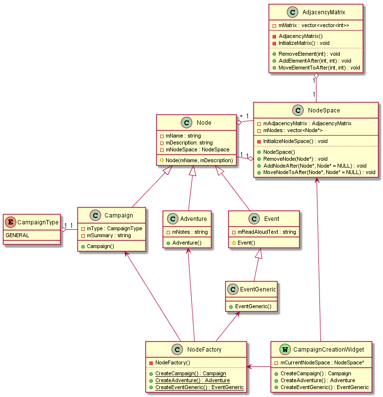

# System Requirements Specification   RPG Toolbox

## Change Log

* 1.0
  * Initial release.

## Introduction

### Document's Purpose
The purpose of this document is to state everything that one must know about the architecture and design of this software. It will present the overview of high-level design, the tools and methods that should be used in coding. It will also list the expected systems and their primary classes and public interfaces.

Design decisions should contain meaningful comments on why they were made, as well as, when suitable, comparisons with other methods that were discarded. GUI elements should also be commented with images used to enforce the words.

### Scope of the Product
RPG Toolbox is a program designed to help GMs and Players in the various aspects of playing RPG tabletop games.

It intends to do so offering several features that are constantly used by GMs and players and can be applied to most systems. It aims to be system agnostic, which means it intends to work on any RPG system by providing general behavior throughout its features. However, and exclusive content for some systems might be included.

### General Workflow

Work on the project is going to be iterative. Which means, everything, especially documents, is going to be revised at regular intervals. The main goal is to create an growing software, that, when receiving new inputs and requirements, can adapt as needed. Even the products description and requirements are likely to change in due time.

Therefore, attention is required at all steps, and adaptability is a key issue. All software must be made with this in mind. As requirements grow, new features ought to be added, and some of them maybe removed. So, modularity is a must have on everything.

As documents get revised and new features are required, code should be revised as well. In the beginning, some systems might seem simple, however, more functionality will be added as the project progresses.

## Software Architecture

### Design Decisions

It was thought of an OOP design. It works greatly with most of the requirements (that have clear objects), and can be extendable to many other functions required, as imports, exports, displaying objects on the screen and the storage of information.

Web development was put aside due to the limitations on opening the software without an active internet connection and to the absent of natural interaction with the OS. So a native application was required. The chosen language was C++. It offers great OOP features as well as many other capabilities that suit the problem well.

Since the software is clearly separated into different systems, that distinction will be very useful in achieving modularity. Therefore, they will be enforced in the design and their connection should be made only when necessary. Another main system will be necessary to handle the interaction of the others and to work as a wrapper for the others.

A model/view architecture will be used to separate the information, in model classes, from the visualization, in view class. So that one can freely change the view without altering the data.

### Tools

####  Framework

The first major decision was on how to tackle the creation of a GUI without using web development. So, a library for creating GUI applications was required and the chosen one was **QT5**.

QT offers several advantages, which include: can be used in C++; supports OOP design; works as a complete framework with multiple useful modules and features. It has everything needed to develop, document and test the whole software and thus, shall be used as primary framework.

Not everything has to contain QT exclusive code. However, its compiler should be used equally across all the program so that we can achieve similar results and reduce complexity. Since QT files require additional compilation, that should be avoided when possible.

#### Editor and IDE

Atom is the main editor used. It provides all the basic functionality required. However, for the editing of the QT files, QT creator is required. It has semantic checking of the reserved words, as well as built-in testing and compiling output.

#### Version Control

Git was chosen for the version control system. Everything is kept on a central repo on Github. A GUI is completely optional. However, GitKraken is recommended.

#### Testing and integration

Travis CI is going to be used to automate the tests and ensure builds are passing, as well as the required tests. It should trigger with every commit so that status on the software is always updated.

### List of systems

* [Main Window](#main-window)
* [Campaign Creation](#campaign-creation)
* [Bestiary](#bestiary)
* [Item Vault](#item-vault)
* [Party Management](#party-management)
* [Encyclopedia](#encyclopedia)
* [Random Tables](#random-tables)
* [*Virtual Tabletop (optional)*](#virtual-tabletop)

## Detailed Design

### Detailed workflow and best practices

Every class should be designed and coded with it's public interface in mind. To achieve that, Test Driven Development (TDD) will be used across all systems. Pseudocode Programming Process (PPP) should also be used, especially when developing complicated private functions, since the pseudocode will help documentation. However, every Class and Method must be properly documented, no matter how simple they are.

The workflow should be as follow:

1. Create unit tests for the public interface.
2. Code the class with public and private methods that fulfil the initial tests. Using PPP when applicable.
3. Write test for the private interface of the class and add more tests to the public one, if need.
4. Make sure everything is documented.
5. Create the integration tests for dependencies checking.
6. Create the pull request!

Following the workflow is a must on every single file, as it will ensure the code quality. UI elements are an exception to that, as they ought to be treated differently. However, they will too, be tested since QT offers GUI testing.

### System Design

#### Main Window

This system is responsible for opening and saving files and managing preferences as well. It will also "hold" the other systems, as they will be presented as tabs in the main window. Its core responsibility is to present a cohesive and clear interface for the user. It will integrate with every other system in the software.

##### Classes

######  MainWindow

This Class is responsible for housing all necessary widgets for the operation of the software as well as features like saving, loading and accessing preferences and help.

#### Campaign Creation

This system will be responsible for the creation, editing and displaying of the nodes. It should provide proper visualization for the nodes, as well as their connections. It should be coded as a widget to fit the main window.

Additional Classes to represent the model/view architecture will be used when necessary.

##### Classes

###### Node

Nodes are plot points that can be literally anything. They should have names and descriptions, be drawn on the screen and be chained together. They must be subclassed into events, adventures or campaigns.

Nodes should form a flowchart, which is essentially a tree. However, they are able to have multiple parents and children. So, they will be represented as a directed graph, since it allows for multiple, directed connections between nodes.

The data structure used will be an Adjacency Matrix as it allows for different types of connections to be represented without having an separe connection class.

###### AdjacencyMatrix

This will be the class responsible for storing the information about connections between nodes. Dummy nodes should be used for improved functionality, one at the beginning of the matrix and other at the end. It should support methods for placing, removing and moving nodes.

Negative numbers will be used when at the head of the arrows (connection *to* node) and positive numbers will be used when at the tail of the arrow (connection *from* node).

* 1 will be used for father-son connections.

###### NodeSpace

This class represents the virtual space where nodes are created and used. It contains the Adjacency matrix. One main space will always exist, associated with the current campaign. However, other subspaces can be created inside nodes.

###### Event

Events are the building blocks of campaigns and adventures. They must also be of different types.

###### EventGeneric

A generic type of event with no special features.

###### Adventure

Adventures are a type of node. They must have and adventure notes field.

###### Campaign

Campaigns are a type of node. They must have a type, specified at creation, and a Summary field.

###### CampaignType

An enumerator that will contain all the different kinds of systems supported.

1. Generic

###### NodeFactory

This will be the class responsible for creating new nodes, receiving inputs from other classes and returning the appropriate kind of node.

###### CampaignCreationWidget

This will be the widget responsible for housing the tools necessary for the creation of the campaigns. As well as the display of the events.

